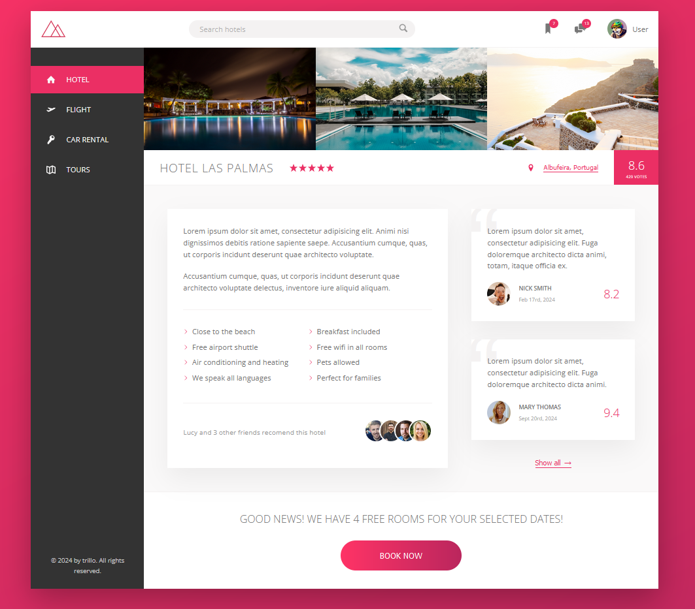

# [Trillo Course Project 2](https://patriciazan.github.io/Trillo-Project/ )

This is the second Project from the course [Advanced CSS and Sass: Flexbox, Grid, Animations and More!](https://www.udemy.com/course/advanced-css-and-sass/) taught by Jonas Schmedtmann on Udemy.
Here I learned the fundamentals of Flexbox and continue practicing:
 - animations;
 - Media queries;
 - Variables.

To start this project you must run in the terminal:
```
npm install
```

And to modify and acesses the page you must:
```
npm run start
```

Check the Project [HERE](https://patriciazan.github.io/Trillo-Project)

_The Complete section_
 
   
